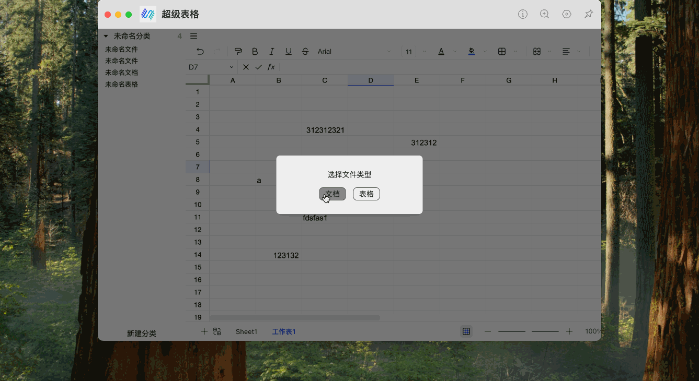

# [Utools](https://www.u-tools.cn/) Plugin with [Univer](https://univer.ai/)

The project is in the development stage. 🚧🚧🚧

## 🌈 How to use

1. Download uTools
   First, you need to download and install uTools. You can get the latest version from the official uTools website: [utools](https://www.u.tools/)
2. Install the uTools-Univer Plugin
   Open uTools and navigate to the **Plugin Store**. In the search bar, type the keyword "univer" or "超级表格". You will find the **uTools-Univer** plugin in the search result.
3. Install the Plugin
   Click on the uTools-Univer plugin in the search results and install it.
4. Launch the Plugin
   Once the plugin is installed, you can use it by opening uTools. Type the keyword "univer" in the uTools search bar, and the uTools-Univer plugin will appear. Click on it to launch the plugin and start using it.
5. ScreenShots
   

## ✨ Features

**uTools-Univer** offers a variety of powerful features for spreadsheets, documents, and presentations. Here’s a quick overview:

### 📊 Univer Sheet

- **Spreadsheet Basics**: Support for cells, rows, columns, worksheets, and workbooks.
- **Formulas**: Includes math, statistical, logical, text, date/time, lookup, engineering, financial, and more.
- **Permissions**: Control access to specific elements.
- **Number Formatting**: Customize number formats based on criteria.
- **Hyperlinks**: Add links to websites, emails, and internal locations.
- **Floating Images**: Insert and position images anywhere in the sheet.
- **Find & Replace**: Search and replace text within a sheet.
- **Filtering & Sorting**: Easily filter and sort data.
- **Data Validation**: Restrict cell input types.
- **Conditional Formatting**: Apply formatting based on cell values.
- **Comments**: Add comments to cells for extra context.
- **Cross-highlighting**: Highlight related cells across the sheet.
- **Pivot Tables**: Summarize and analyze data with pivot tables.

  

### 📝 Univer Doc

- **Core Features**: Support for paragraphs, headings, lists, superscripts, subscripts, etc.
- **Lists**: Ordered, unordered, and task lists.
- **Hyperlinks**: Insert links to websites, emails, and other document locations.
- **Floating Images**: Insert images with flexible text wrapping.
- **Headers & Footers**: Add headers and footers to documents.
- **Comments**: Add comments for additional information.

### 🗂️ Virtual File System in uTools DB

- **Customizable Structure**: Create and manage folders to categorize your documents and spreadsheets.
- **File Management**: Add, rename, move, and delete files within the virtual system.
- **Organized Workspace**: Keep your projects and related files neatly arranged for easier navigation.

  
